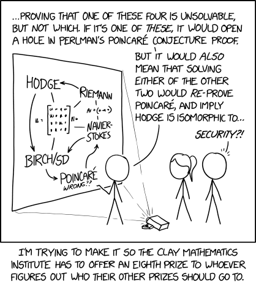

# Formalization of the Millennium Prize Problems in Lean4.

This is a repository for the Lean Millennium Problems project. The goal of this project is to formalize the Millennium Problems in the Lean theorem prover which is the first of its kind. The Millennium Problems are seven problems in mathematics that were stated by the Clay Mathematics Institute in 2000. A correct solution to any of these problems results in a one million dollar prize. As of now only the Poincaré Conjecture has been solved. I would hope that one day the there would be an 8th Millennium Problem that is to have the full formalization/solutions of all the Millennium Problems in Lean or even better a full formalization of the whole field of mathematics in Lean.

**Note:** I tried to formalize the problems as accurately as possible. However, I am not a mathematician, so there may be inaccuracies in the formalizations. If you find any inaccuracies, please let me know! The formalizations are complete in the sense that I use definitions (That I think are important to define the conjectures) that have sorries in them and I do not prove all definitions/theorems that are needed to formalize the problems. I hope that this project can be a starting point for a bigger project where we can formalize all the definitions and theorems needed to fully say the formalization of the conjectures is complete from ground up like the Poincaré Conjecture formalization which is already in Mathlib.

## Installation

To install Lean, follow the instructions at [the Lean website](https://leanprover.github.io/).

## Folder Structure

The Problems are the main folder of the project. The stars indicate the completion of the formalization of the problem as in the definitions/theorems needed to state the problem precisely in Lean. All the conjectures are fully defined assuming the definitions are correct. It contains the following subfolders.

1. **HodgeConjecture** : ⭐⭐☆☆☆ (Partial Completion)

   This problem concerns the relationship between algebraic geometry and topology in complex manifolds. The Hodge Conjecture states that certain types of cohomology classes (called Hodge classes) on projective algebraic varieties are rational linear combinations of cohomology classes of algebraic cycles. My formalization focuses on defining smooth projective varieties, cohomology groups, and the key concepts of Hodge classes and algebraic cycles. References include Claire Voisin's "Hodge Theory and Complex Algebraic Geometry", Wikipedia and materials from the Clay Mathematics Institute.

2. **NavierStokes** : ⭐⭐⭐⭐☆ (Nearly Complete for Bounded Domain Formulation ie on the Torus) and ⭐⭐⭐⭐⭐ (Complete for Unbounded Domain Formulation)

   This problem asks whether solutions to the Navier-Stokes equations (which model fluid flow) always remain smooth and well-defined, or whether they can develop singularities in finite time. The formalization includes definitions of classical and weak solutions, energy inequalities, and the precise statements of the millennium problem in both unbounded and periodic domains. I drew upon Evans' "Partial Differential Equations" textbook and the official Clay Mathematics Institute problem description by Charles Fefferman as well as asked my friends who work in PDE theory for verification.

3. **PvsNP** : ⭐⭐⭐⭐☆ (Nearly Complete) 

   This problem asks whether every computational problem whose solution can be quickly verified (NP) can also be quickly solved (P). My formalization defines the complexity classes P and NP using Turing machines, polynomial-time computation, and verification. I also included a formalization of the polynomial hierarchy. The main references were my undergraduate complexity theory course notes, Sipser's "Introduction to the Theory of Computation" and Arora & Barak's "Computational Complexity: A Modern Approach".

4. **RiemannHypothesis** : ⭐⭐⭐⭐⭐ (Complete)
 
   This conjecture states that all non-trivial zeros of the Riemann zeta function have real part equal to 1/2. The formalization defines the critical strip, critical line, non-trivial zeros, and related concepts like the von Mangoldt function and the Li criterion. References included Edwards' "Riemann's Zeta Function", Wikipedia, My undergraduate complex analyis notes and Bombieri's "Problems of the Millennium: the Riemann Hypothesis".

5. **YangMillsExistenceAndMassGap**: ⭐⭐☆☆☆ (Partial Completion)

   This problem asks for a rigorous mathematical construction of quantum Yang-Mills theories and a proof that they exhibit a "mass gap" (positive minimum energy). The formalization includes definitions of spacetime, gauge groups, gauge fields, quantum field axioms (Wightman and Osterwalder-Schrader), and the mass gap property. References included Jaffe & Witten's "Quantum Yang-Mills Theory" and some part of the standard quantum field theory textbooks like Streater & Wightman's "PCT, Spin and Statistics, and All That".

6. **BirchSwinnertonDyer**: ⭐⭐⭐☆☆ (Moderate Complete)

   This conjecture relates the rank of an elliptic curve's Mordell-Weil group to the behavior of its L-function. The formalization includes definitions of elliptic curves, their Mordell-Weil groups, L-functions, and both parts of the BSD conjecture (rank equals order of zero, and formula for leading coefficient). References included Silverman's "The Arithmetic of Elliptic Curves", my undergraduate complex analysis/number theory notes and Tate's "The Arithmetic of Elliptic Curves".

7. **PoincareConjecture** : ⭐⭐⭐⭐⭐ (Complete)

   This theorem (proven by Perelman in 2003) states that every simply connected, closed 3-manifold is homeomorphic to the 3-sphere. Although this problem has been solved, I included a formalization that defines the key topological concepts involved and states the conjecture precisely. I utilized the existing definitions in Mathlib while simplifying the presentation. References included Milnor's "The Poincaré Conjecture", Wikipedia and Morgan & Tian's "Ricci Flow and the Poincaré Conjecture".

Each problem's formalization includes core definitions necessary to state the problem precisely in Lean, with `sorry` placeholders for components that would require substantial additional development. For problems requiring specialized mathematical background (Problems 1, 5, 7) beyond my expertise, I consulted with Claude AI to understand the basics and ensure the formalizations captured the essential mathematical structures correctly plus heavily used LeanSearch and Mathlib for definitions and theorems.

Each of these subfolders contains a Lean file with the name Millennium.lean having the main formalized problem.

## References/Tools/Documentation

1. https://www.claymath.org/millennium-problems/
2. https://en.wikipedia.org/wiki/Millennium_Prize_Problems
3. https://www.claymath.org/millennium-problems/
4. https://leansearch.net/
5. https://leanprover-community.github.io/mathlib4_docs/
6. Github Copilot (Specifically only Claude 3.7 Sonnet, Gpt v0 does not work well with Lean)

## Contributing

If you would like to contribute to this project, please contact me! I hope that we can work together to formalize all the Millennium Problems Fully with all definitions in Lean and make this a bigger formalization project and hopefully someone can add the full proof of the Poincaré Conjecture as well. For the NavierStokes one can notice a lot of formalization has been done for partial derivatives etc and so the formalization is fully complete as this is part of our lab's bigger goal to formalize the Evan's Graduate Textbook in PDEs in Lean. 
