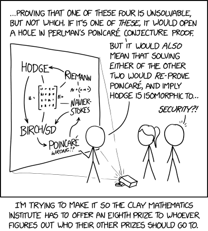

# Millennium Prize Problems in Lean 4

This repository contains Lean 4 formulations of the seven Millennium Prize Problems described by
the Clay Mathematics Institute. It focuses on the problem statements and the mathematics needed to
express them—not on claiming solutions.

<p align="center">
  
</p>

## Getting started

```bash
lake build
python3 scripts/clay_refs.py verify
```

The first command checks the Lean development. The second verifies the local copies of the official
Clay PDFs.

## The seven problems

| Problem | Lean file | Main declaration | Status |
|---|---|---|---|
| P versus NP | `Problems/PVersusNP/Millennium.lean` | `Millennium.clay_prize_p_versus_np` | Open |
| Riemann Hypothesis | `Problems/RiemannHypothesis/Millennium.lean` | `Millennium.clay_prize_riemann_hypothesis` | Open |
| Navier–Stokes | `Problems/NavierStokes/Millennium.lean` | `MillenniumNavierStokes.clay_prize_navier_stokes` | Open |
| Hodge Conjecture | `Problems/Hodge/Millennium.lean` | `MillenniumHodge.clay_prize_hodge_conjecture` | Open |
| Birch and Swinnerton-Dyer | `Problems/BirchSwinnertonDyer/Millennium.lean` | `MillenniumBirchSwinnertonDyer.clay_prize_birch_swinnerton_dyer` | Open |
| Yang–Mills existence and mass gap | `Problems/YangMills/HamiltonianSpectrum.lean` | `MillenniumYangMills.clay_prize_yang_mills` | Open |
| Poincaré Conjecture | `Problems/Poincare/Millennium.lean` | `MillenniumPoincare.clay_prize_poincare_conjecture` | Solved by Perelman; Lean proof not included |

Each file ends with a declaration named `clay_prize_*`. Its body is currently `sorry`, marking the
place where a complete formal proof would go. There are exactly seven such placeholders—one for
each problem.

P versus NP is slightly different because either `P = NP` or `P ≠ NP` would settle the problem.
`ClayPVersusNPResolution` represents both possibilities with the constructors `equal` and
`notEqual`.

## Formalization scope

The statements follow the Clay PDFs included in this repository. Some subjects require explicit
interfaces for mathematics that is not yet available directly in Mathlib:

- Hodge theory uses a realization package for rational and complex cohomology, the Hodge
  decomposition, and algebraic cycle classes.
- Yang–Mills uses an axiomatic quantum-field-theory model and records both bounded and unbounded
  Hamiltonian formulations.
- Birch and Swinnerton-Dyer packages the analytic continuation of the relevant L-series as explicit
  data.
- P versus NP uses a concrete finite-alphabet Turing-machine model.

The detailed choices and related declarations are listed in `Problems/Registry.lean` and documented
inside the corresponding Lean files.

## Repository layout

| Path | Contents |
|---|---|
| `Problems/` | The seven statements and their supporting definitions |
| `Problems/Common/` | Definitions shared by several problems |
| `Problems/Registry.lean` | A checked index of the problems, their status, and related declarations |
| `Problems/*/references/clay/` | Local copies of the official Clay PDFs |
| `scripts/clay_refs.py` | Downloads or verifies the Clay PDFs |

## References

- [Clay Mathematics Institute: Millennium Problems](https://www.claymath.org/millennium-problems/)
- [Lean 4](https://leanprover.github.io/)
- [Mathlib documentation](https://leanprover-community.github.io/mathlib4_docs/)

## Contributing

Contributions that improve the accuracy of the statements, replace temporary mathematical
interfaces with native Mathlib constructions, or provide formal proofs are welcome.
